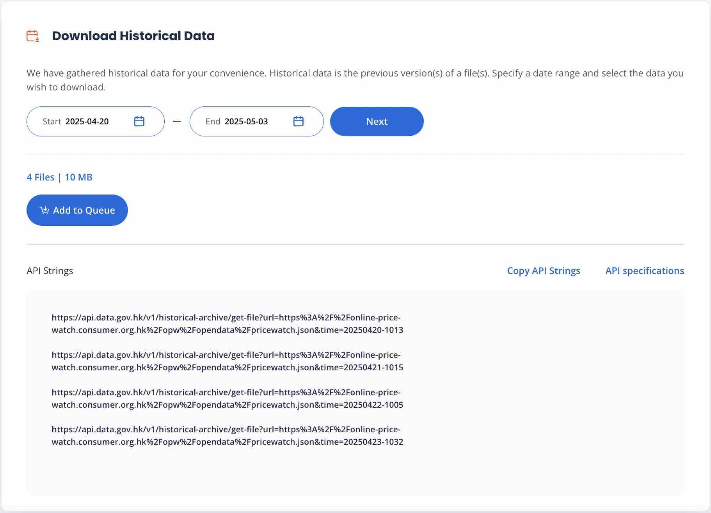

# Known Issues

## Issue: Unavailability of Online Price Watch Data from DATA.GOV.HK
### Description
The historical data API provided by data.gov.hk is expected to return a data file for each day. However, it has been observed that the API often misses data files for some periods of time, leading to gaps in the historical data.
### Affected Areas
- Historical data retrieval functionality.
- SuperPriceWatchdog relies on complete daily datasets.
### Symptoms
- Missing data files for specific dates when querying the historical data API.
- Inconsistent data availability, which affects data integrity and analysis.
### Workarounds
- **Disable Price Alert**: No alert will be sent out when the upstream data is unavailable.
- **Record Incomplete Dates**: Log the frequency of API calls when it does not provide daily data for record-keeping.
### Status
- ~~No ticket has been raised with data.gov.hk to address this issue, and we will monitor how long the problem persists.~~
- A feedback form (Ref: 1746966652-A-GG748) has been submitted to data.gov.hk regarding the issue.
- Data is now available on data.gov.hk after the feedback form was submitted.
- It was found that the data is only available on a different API, which is not specified in the API specification.
### Appendix

  
  
<i>Only 4 records are returned while 14 are expected.</i>

