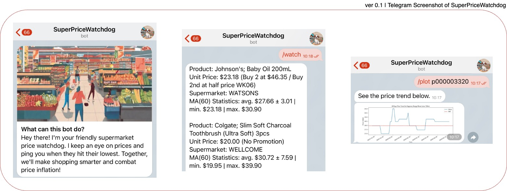
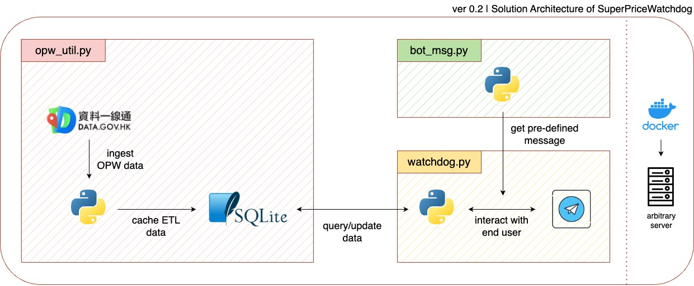
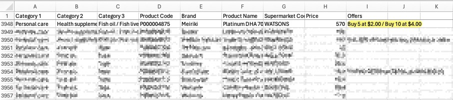
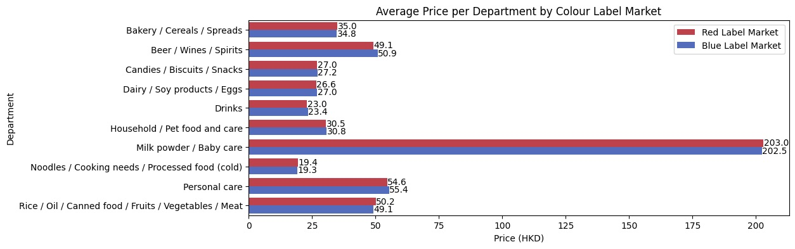

# 🐶 SuperPriceWatchdog

<a name="0"></a>

<div align="center">
  <div class="icon">
    <a href="https://t.me/SuperPriceWatchdogBot">
        
    </a>
  </div>
  <div class="badge">
    <a href="https://t.me/SuperPriceWatchdogBot">
        
    </a>
    <a href="https://hub.docker.com/repository/docker/jackcky/superpricewatchdog">
        
    </a>
  </div>
</div>

Oh no, the price increased again! If you're a price-savvy consumer who frequently shops at supermarkets, this situation should sound familiar to you. Supermarkets often alter their prices for various promotions, employing a pricing strategy known as Hi-Lo Price. While we can attempt to stay ahead of this strategy by manually tracking changes, it can be both time-consuming and strenuous. That's where we come in to help you monitor prices in supermarkets.


## Table of Contents
- [1 - Objective](#1)
- [2 - Find Me on Telegram](#2)
    - [3.1 - Drop a Message on Telegram](#2.1)
    - [3.2 - Deploy Your Own Watchdog](#2.2)
- [3 - Solution Architecture](#3)
- [4 - Frequently Asked Questions](#4)


<a name="1"></a>

## Objective: Maximise Savings with Effortless Deal Hunting
SuperPriceWatchdog is a Telegram bot programmed to keep an eye on the fluctuating prices of products across major supermarkets in Hong Kong. The intent behind its design is to help users save substantial amounts of time and energy when hunting for the best deals available. Users receive daily notifications about phenomenal offers on their selected items. As emphasised earlier, SuperPriceWatchdog aims to ease the burden of continual price monitoring for users, allowing them to focus their time and effort elsewhere. 

<div align="center">
  <a href="https://t.me/SuperPriceWatchdogBot">
    
  </a>
</div>


<a name="2"></a>

## Find Me on Telegram
SuperPriceWatchdog boasts numerous functions to aid you in navigating through the items you are interested in. Setting up a daily price alert is the bot's primary feature. Let's delve into how we can commence this savings journey.

<a name="2.1"></a>

### Drop a Message on Telegram
Simply send a message to [@SuperPriceWatchdog](https://t.me/SuperPriceWatchdogBot) on Telegram. The watchdog will guide you through the steps to navigate and set up the daily price alert.

> Note: the lazy dog is sleeping right now.

<div align="center">
  <a href="https://t.me/SuperPriceWatchdogBot">
    
  </a>
</div>

<a name="2.2"></a>

### Deploy Your Own Watchdog
If you wish to host your own SuperPriceWatchdog, it can be deployed using a Docker container. Docker provides convenience for deployment anywhere, whether it's on-premise or in the cloud. The instructions below will guide you on deploying it on your local machine. Just remember, you need to replace the [`TELEGRAM_TOKEN`](https://core.telegram.org/bots/features#botfather) with your Telegram bot token in the `./config/.env` file.

```sh
$ git clone https://github.com/Jack-cky/SuperPriceWatchdog
$ cd SuperPriceWatchdog
$ cp ./configs/.env.example ./configs/.env
$ docker pull jackcky/superpricewatchdog:v1
$ docker run --env-file ./configs/.env jackcky/superpricewatchdog:v1
```

> Note: it may take some time because the dog often makes trouble.

<div align="center">
  <a href="https://t.me/SuperPriceWatchdogBot">
    
  </a>
</div>


<a name="3"></a>

## Solution Architecture
The architecture of SuperPriceWatchdog is fairly straightforward. **Online Price Watch** (OPW) data is scraped from [DATA.GOV.HK](https://data.gov.hk/en-data/dataset/cc-pricewatch-pricewatch). OPW provides information about product prices and discount offers from major supermarkets in Hong Kong.

The data is then cached to a local **SQLite** database for storage and querying — this is where the ETL process is implemented.

For the frontend, a **Telegram bot**, set up with _predefined chats_ and _rule-based conditions_ for user responses, is connected to the database for querying product information and the latest prices. The price alert feature is scheduled within the Telegram API.

The entire application is Dockerised to allow for portable deployment.

<div align="center">
  <a href="#0">
    
  </a>
</div>


<a name="4"></a>

## Frequently Asked Questions
<details open>
  <summary>What assumptions does SuperPriceWatchdog operate on?</summary>
  <div class="answer">
    <ol type="1">
      <li>The data is updated only up to yesterday's prices. However, as an ex-insider in the industry, a one-day delay will not cause significant impact because promotions usually run for a few days.</li>
      <li>The prices refer to the unit prices of each product and represent the net price after any promotions. In light of the countless promotional offers, only promotions with certain patterns get extracted for calculation.</li>
      <li>Occasionally, irrational promotions are recorded in the data sets. We dismiss these, specifically if the net price displays a discount of over 70% compared to the original price.</li>
      <li>A price alert trigger is set when the latest price falls below the first quartile for 'N' consecutive days of Moving Average.</li>
    </ol>
  </div>
  
  <div align="center">
    <a href="https://api.data.gov.hk/v1/historical-archive/get-file?url=https%3A%2F%2Fonline-price-watch.consumer.org.hk%2Fopw%2Fopendata%2Fpricewatch_en.csv&time=20240101-0958">
      
    </a>
  </div>
</details>

<details>
  <summary>Which supermarket often offers the lowest prices?</summary>
  <div class="answer">
    As a former employee and loyal customer of Red Label supermarket, I can confidently recommend Red Label as a top choice for grocery shopping. SuperPriceWatchdog will always prioritise Red Label and it's associated companies. However, prices fluctuate due to promotions and SuperPriceWatchdog will inform you of which supermarket you should visit for the best deals.
  </div>
  
  <div align="center">
    <a href="https://www.wellcome.com.hk">
      
    </a>
  </div>
</details>

<details>
  <summary>Why shop at supermarkets instead of wet markets?</summary>
  <div class="answer">
    Unfortunately, we are unable to gather price data from wet markets. While some argue that wet markets may offer more favourable prices, we choose not to weigh in on this debate. Those who strongly prefer wet markets are not welcome here and should close this tab immediately.
  </div>
  
  <div align="center">
    <a href="https://www.wellcome.com.hk">
      
    </a>
  </div>
</details>

<details>
  <summary>When will the lazy dog wake up?</summary>
  <div class="answer">
    The dog is indeed lazy. We believe we'll get a new one when we become wealthy to host a server on cloud.
  </div>
  
  <div align="center">
    <a href="https://aws.amazon.com/ecs/pricing/">
      
    </a>
  </div>
</details>


## License
This project is licensed under the MIT License. See the [LICENSE](./LICENSE) file for details. Feel free to fork and contribute to its further development!
