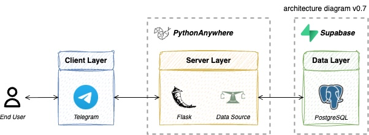

<!-- INTRODUCTION -->
# 🐶 SuperPriceWatchdog

  
  
  

 In the current climate of rising costs, many consumers are feeling the pinch at the checkout. If you are a budget-conscious shopper who frequently visits supermarkets, this scenario is likely all too familiar. Supermarkets often adjust their prices for various promotions, utilising a pricing strategy known as [Hi-Lo Pricing](https://en.wikipedia.org/wiki/High%E2%80%93low_pricing).

While it is possible to track these fluctuations manually, such an approach can be both time-consuming and exhausting. To alleviate this burden, we are pleased to introduce SuperPriceWatchdog, a tool designed to help you monitor supermarket prices effectively.

**First Published:** 15 February 2024  
**Last Updated:** 22 June 2025

<!-- ROADMAP -->
## Table of Contents
- [1 - Motivation](#1)
- [2 - When Should I Buy This Item?](#2)
    - [2.1 - Be Notified of Latest Deals](#2.1)
    - [2.2 - Price Alert Design](#2.2)
- [3 - Solution Architecture](#3)
    - [3.1 - System Design](#3.1)
- [4 - Contribute to This Project](#4)

<!-- SECTION 1 -->

## Motivation: Maximise Savings with Effortless Deal Hunting
SuperPriceWatchdog stands for **Super**market **Price** **Watchdog**. It is a Telegram bot designed to monitor the fluctuating prices of products across major supermarkets in Hong Kong. The goal of its creation is to help users save significant amounts of time and effort while searching for the best available deals.

Users receive daily notifications (except on Fridays and Saturday) about exceptional offers on their selected items. As highlighted previously, SuperPriceWatchdog seeks to alleviate the hassle of constant price monitoring, allowing users to redirect their time and energy towards other pursuits.

  
  
<i>a poor golden son didn't know how to play the game.</i>

<!-- SECTION 2 -->

## When Should I Buy This Item?
SuperPriceWatchdog offers a variety of features to help you navigate the items you are interested in. Setting up a daily price alert is the bot's key function. Let’s explore how you can embark on this journey to savings.

### Be Notified of Latest Deals
Simply drop a message to [@SuperPriceWatchdog](https://t.me/SuperPriceWatchdogBot) on Telegram, and you will receive guidance on how to navigate the bot and set up your daily price alert.

> [!NOTE]  
> Latency is expected because SuperPriceWatchdog relies on community servers.

> [!WARNING]  
> Prices shown are not current; they are from two days ago.

> [!IMPORTANT]  
> No alerts will be sent out when the API call from DATA.GOV.HK does not function properly, such as when data for a specific date is missing. Please see the [KNOWN_ISSUES](KNOWN_ISSUES.md) section for details.

  

### Price Alert Design
SuperPriceWatchdog collects 90 days of price records and calculates statistics for each item. When the standardised unit price (after promotion) is below one standard deviation from its mean, i.e., $Pr(Z \leq -1)$, that item is considered the best deal. The price monitoring is entirely automated and requires minimal effort. Unlike the official price alerts, users are required to set a target price manually or adjust it based on intuition.

Promotion weeks start on Fridays, meaning most prices are refreshed every Friday (based on my past experience as a Red Label Supermarket employee). Unfortunately, the latest record of Online Price Watch (OPW) data refers to prices and promotions from two days before, which means the prices in our database may not reflect the most current prices. To avoid confusion, price alerts are set to be disabled on Fridays and Saturdays.

  

<!-- SECTION 3 -->

## Solution Architecture
SuperPriceWatchdog is built on top of the **Consumer Council**'s [OPW](https://data.gov.hk/en-data/dataset/cc-pricewatch-pricewatch) data, which provides item prices and promotions from supermarkets.

Each day, a data pipeline retrieves data and stores it in a **PostgreSQL** database. The ETLT process is orchestrated with _Luigi_ and uses _Polars_ and _PSQL_ functions to handle data structure and manipulation. At the end of the pipeline, a daily price alert is triggered and sent to users. Through a webhook method, users interact with SuperPriceWatchdog on **Telegram** by sending requests to a **Flask** application that processes their messages.

The web application is hosted on a **PythonAnywhere** Beginner account, while the database is maintained on **Supabase** Free subscription. These providers generously offer serverless computing resources, making it possible to host and operate the service at no cost.

  

### System Design
To optimise for limited computing resources, we minimise the workload into a single web application with a cron job trigger. The source code is version-controlled using GitHub and implemented with CI/CD to streamline deployment.

In the current setup on PythonAnywhere, the website hosting on the Beginner account has an expiration period. We will regularly reactivate these services to ensure that SuperPriceWatchdog remains fully operational.

  

<!-- SECTION 4 -->

## Contribute to This Project
SuperPriceWatchdog is by no means intended for commercial use. It is available for free and hosted on community servers, designed to assist shoppers in finding the best deals across supermarkets. We invite you to get involved and contribute to the SuperPriceWatchdog project, enhancing the service for the community.

Your feedback, suggestions, and support can significantly improve our features and user experience. We encourage you to create issues in this repository to collaborate and share your ideas. Join us in our mission to empower consumers and maximise savings. Together, we can make shopping smarter and more efficient for everyone!

  

<!-- MISCELLANEOUS -->

## Product Backlog
This project is managed using a product backlog. You can review the [backlog](https://docs.google.com/spreadsheets/d/1hZBngU6REh5M9iyUclPlf8IyO3Iz3ZVW1exo_-vM1ks/pubhtml?gid=1316504644&single=true) to understand the prioritised list of features, changes, enhancements, and bug fixes planned for future development.

## License
This project is licensed under the MIT License. See the [LICENSE](LICENSE) file for details. Feel free to fork and collaborate on the project!
